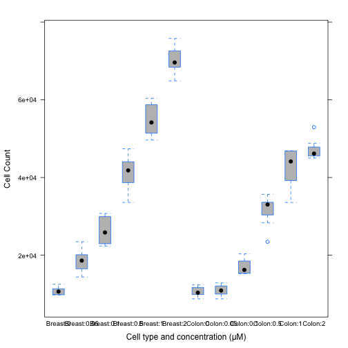
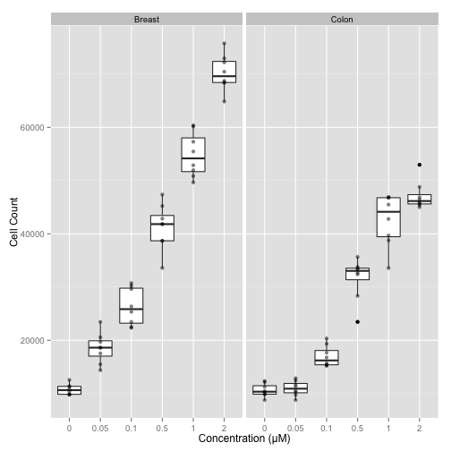
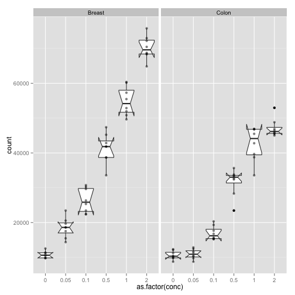

The Bio 255 Labs at Macalester
========================================================
author: Using R as a scientific tool
date: Danny Kaplan Feb. 11, 2014


The Biology Courses
========================================================

## BIOL 260  --- Genetics

An introduction to the principles of genetics, including topics from classical Mendalian concepts to the contemporary molecular biology of the gene. Three lecture hours per week.

## BIOL 265 --- Cell Biology

An introduction to the molecular and cellular processes of living organisms. Special attention is paid to problems faced by living cells in the acquisition of energy, growth and repair, reproduction and communication with other cells. Recent advances in biotechnology are also discussed.Three lecture hours.

### Both courses share a lab.


========================================================
title: none

## BIOL 255 - CELL BIOLOGY AND GENETICS 
## LABORATORY METHODS

An intensive exploration of eukaryotic and prokaryotic cell structure, chemistry, and function with an emphasis on laboratory methods, data analysis, and experimental design. Using the same tools used to advance our understanding of modern cell biology and genetics, this lab requires students to become familiar with a mixture of biochemical, cytological, and genetic techniques as they develop testable hypothesis related to topics such as enzyme function, inheritance patterns, genome structure and gene expression, and cell-to-cell signaling.

Link to publicly available lab materials: <http://paulyeo21.github.io/cell_bio_gen_lab/lab_docs.html>   

Lab Schedule
=======================================================

Week 1: Graphing Data and Statistical Analysis    
Week 2: Solutions and DNA Gel Electrophoresis    
Week 3: Fluorescence/ Spectroscopy    
Week 4: Microscopy    
Week 5: Bioinformatics    
Week 6: Introduction to β-Galactosidase System in Escherichia coli    
Week 7: Laboratory Exam    
Week 8: Induction to β-Galactosidase System in Escherichia coli    
Week 9:  Oral Presentations for Week 6   
Week 10: Roundup Ready-Looking for a Gene: Background and Bioinformatics    
Week 11: Roundup Ready Lab: DNA extraction and PCR    
Week 12: Roundup Ready Lab: Run and analyze DNA gel    
Week 13: Senior Student Presentations

Objectives of this talk
===============================================
title: none

One possibility for what an R-based lab can look like.

* Students hired under our HHMI grant as Stats Fellows
* Most of a summer dedicated to producing these materials.
* **I did not participate** in creating these labs.
    * General consultant and trouble-shooter. (I'm the R guru on campus.)
    * I did help create an R ecosystem that got the students going.
    
 
        
Lab authors: Cory Stern, Paul Yeo, Paul Overvoorde, 

R-related elements of the labs
===========================================
    
* Lab write-ups as Markdown documents
    * Markdown: A light-weight, easy to learn notation.
    * Integrates and documents each step in the data analysis.
* Tutorials: Video and interactive
* Lab activities in R


Week I: Basic Lab Skills: Graphing and Statistics
===========================================

Work with data from a cell culture and poliferation assay.

To quote from the lab ...

===========================================
title: none

1. Breast and colon cancer cell lines were cultured separately in a 96-well plate at a known and constant density.
2. Cells were then incubated in the presence of either vehicle or varying concentrations of LPA. (Note: What is meant by a vehicle in molecular biology?)
3. Reagents were replenished daily.
4. After three days, CellTiter 96 AQueous (MTS) One Solution reagent (Promega) was added to each well, and absorbance was recorded at 490 nm by using a SpectraMax Plus plate reader (softmaxpro 401, Molecular Devices).
5. Cell numbers were then calculated by using a standard curve correlating the absorbance to the cell number counted under a microscope.
6. Multiple trials (A-H) were done with each cell line.

The data
=============================


* Later ... comments on why statistics students should know more about data organization than this.

=============================
title: none

Using the raw data and the information below, do the following:

1. Prepare a spreadsheet of the data ... Read the data into R. Use R to show your data frame, its dimension, and the names of your experimental groups.    
2. Find the mean and standard deviation of each experimental group, using R for the calculations. What are the experimental groups for this assignment? Are there 2 (colon and breast) or are there 12 (one for each column)?    
3. Give clearly labeled and clearly presented graph(s) of this study.    
    * Graphs should be suitable for publication in a scientific journal. Therefore they must include all information necessary for understanding the context of the plot: informative title, axes labels, figure legend (caption).
4. In a separate paragraph, clearly explain your rationale for the choice of the type(s) of graphs you made (scatterplot, boxplot, line graph, etc).    


=============================
title: none

Enter the data with proper variable names

```r
CellNumbers <- read.csv("CellProliferationData.csv", skip=1 )
```


```
  rep Colon1 Colon2 Breast1 Breast2 Breast3
1   A  12156  11333   11345   23467   23467
2   B  12359  12875   10846   20566   30753
3   C   8766  10276    9846   15487   25344
4   D   9888  12455   12566   18577   30233
5   E  11235   9735    9855   19687   29641
```

===============================
title: none

### Means of groups

A very direct approach: 

```r
mean(Colon1, data=CellNumbers)
```

```
[1] 10618.88
```

```r
mean(Colon2, data=CellNumbers)
```

```
[1] 10954.5
```

Are there 8 cases and 12 variables? Or 96 cases?

A more general format is with 96 cases

* applicable to any layout of cells
* much easier to process

96 cases
==================================

Students could have entered the data this way in the first place.

But it's straightforward to do automatically.  Students would need a template.

* Make and read in  a second file with column explanations.

```r
Columns <- read.csv("ColumnExplanations.csv")
```


```
  column  type conc
1 Colon1 Colon 0.00
2 Colon2 Colon 0.05
3 Colon3 Colon 0.10
4 Colon4 Colon 0.50
5 Colon5 Colon 1.00
6 Colon6 Colon 2.00
```
and so on.                     

Reformat count data into "narrow" format
====================================


```r
Narrow <- gather(CellNumbers, 
                 key="column", value="count", 
                 Colon1:Breast6)
```

```r
Narrow 
```

```
   rep  column count
1    A  Colon1 12156
2    B  Colon1 12359
3    C  Colon1  8766
4    D  Colon1  9888
5    E  Colon1 11235
6    F  Colon1 10259
7    G  Colon1  9853
8    H  Colon1 10435
9    A  Colon2 11333
10   B  Colon2 12875
11   C  Colon2 10276
12   D  Colon2 12455
13   E  Colon2  9735
14   F  Colon2 11708
15   G  Colon2  8766
16   H  Colon2 10488
17   A  Colon3 15444
18   B  Colon3 16765
19   C  Colon3 19333
20   D  Colon3 17666
21   E  Colon3 15666
22   F  Colon3 15267
23   G  Colon3 20346
24   H  Colon3 15244
25   A  Colon4 28333
26   B  Colon4 35666
27   C  Colon4 33389
28   D  Colon4 33467
29   E  Colon4 32387
30   F  Colon4 23458
31   G  Colon4 32693
32   H  Colon4 33788
33   A  Colon5 33576
34   B  Colon5 45488
35   C  Colon5 46888
36   D  Colon5 46876
37   E  Colon5 38768
38   F  Colon5 46754
39   G  Colon5 39688
40   H  Colon5 42788
41   A  Colon6 45673
42   B  Colon6 46455
43   C  Colon6 45007
44   D  Colon6 52965
45   E  Colon6 45865
46   F  Colon6 48823
47   G  Colon6 45450
48   H  Colon6 46872
49   A Breast1 11345
50   B Breast1 10846
51   C Breast1  9846
52   D Breast1 12566
53   E Breast1  9855
54   F Breast1 10423
55   G Breast1  9766
56   H Breast1 11355
57   A Breast2 23467
58   B Breast2 20566
59   C Breast2 15487
60   D Breast2 18577
61   E Breast2 19687
62   F Breast2 18655
63   G Breast2 17539
64   H Breast2 14387
65   A Breast3 23467
66   B Breast3 30753
67   C Breast3 25344
68   D Breast3 30233
69   E Breast3 29641
70   F Breast3 26358
71   G Breast3 22356
72   H Breast3 22455
73   A Breast4 41805
74   B Breast4 42854
75   C Breast4 38688
76   D Breast4 41844
77   E Breast4 47386
78   F Breast4 33587
79   G Breast4 45222
80   H Breast4 38699
81   A Breast5 52877
82   B Breast5 51965
83   C Breast5 50847
84   D Breast5 49651
85   E Breast5 60167
86   F Breast5 55467
87   G Breast5 57299
88   H Breast5 60387
89   A Breast6 75786
90   B Breast6 68745
91   C Breast6 68456
92   D Breast6 72199
93   E Breast6 70466
94   F Breast6 64856
95   G Breast6 72955
96   H Breast6 68344
```

Join with the column information
==============================


```r
ReadyToUse <- inner_join( Narrow, Columns)
```

```
  rep  column count   type conc
1   H Breast1 11355 Breast 0.00
2   A  Colon1 12156  Colon 0.00
3   H  Colon1 10435  Colon 0.00
4   G  Colon2  8766  Colon 0.05
5   C Breast3 25344 Breast 0.10
6   H Breast4 38699 Breast 0.50
7   F  Colon4 23458  Colon 0.50
8   F  Colon5 46754  Colon 1.00
```

Statistical Tasks
==============================

Mean and sd of each experimental group

```r
mean(count ~ type, data = ReadyToUse)
```

```
  Breast    Colon 
36990.12 26654.90 
```

```r
sd(  count ~ type, data = ReadyToUse)
```

```
  Breast    Colon 
21212.23 15119.93 
```

Or, by both type and concentration:
====================


```r
mean(count ~ type + conc, data = ReadyToUse)
```

```
   Breast.0     Colon.0 Breast.0.05  Colon.0.05 
   10750.25    10618.88    18545.62    10954.50 
```

```r
sd(  count ~ type + conc, data = ReadyToUse)
```

```
   Breast.0     Colon.0 Breast.0.05  Colon.0.05 
   979.8358   1224.0219   2860.5737   1394.1481 
```

Statistical Tasks
===========================

Give clearly labeled graph of this study


```r
bwplot(count ~ cross(type, conc), data = ReadyToUse, 
       fill="grey", xlab="Cell type and concentration (μM)",
       ylab="Cell Count")
```

 

Or, even more professionally
====================================


```r
ggplot(data=ReadyToUse, 
       aes(x=as.factor(conc), y=count)) +
  geom_boxplot() + 
  geom_point(alpha=.5, size=2) +
  facet_wrap( ~ type ) + xlab("Concentration (μM)") + 
  ylab("Cell Count")
```

 

Or, with inference built in
=====================================


```r
ggplot(data=ReadyToUse, aes(x=as.factor(conc), y=count)) +
  geom_boxplot(notch = TRUE) + 
  geom_point(alpha=.5, size=2) +
  facet_wrap( ~ type )
```

 

