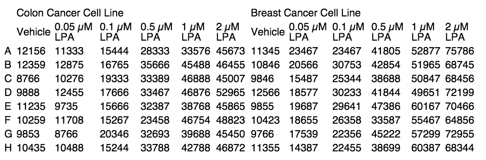

Link to resources: <http://dtkaplan.github.io/Muhlenberg/>

Link to [this document](Overall_Outline.html) and its [Rmd source](Overall_Outline.Rmd) 

**********

## Using R for Teaching

### Early 1990s: Ross Ihaka and Robert Gentleman: 

> We both had an interest in statistical computing and saw a common need for a better software environment in our Macintosh teaching laboratory. We saw no suitable commercial environment and we began to experiment to see what might be involved in developing one ourselves. ^[<http://cran.r-project.org/doc/html/interface98-paper/paper_1.html>]

### 1995: R becomes open-source

### 1998: From my annual report to Macalester.

> In 1997-98 I wrote a series of 10 R-language computer
laboratories for the introductory statistics courses (Math 14 and 27).
Experience showed these labs to be far too ambitious; I radically simplified
them the second time and they were used with quite favorable results.
Further development of these labs awaits a group decision on what software
to use in introductory courses.

### 2005: Expands beyond statistics at Macalester

Use of R in our Applied Calculus class means that several mathematics faculty started teaching with R.

### 2014: Strong signs of becoming standard

* Approximately half of all Mac students will take an R-based course in their college career at Macalester.
* Roughly 500 students (out of 2000) are enrolled in an R-based course in any given semester. 
* Approximately 20 sections of nine different courses use R intensively. 
* Biology department switches over to R for computing in labs.

### The ark of R history: 

* First 5 years: You can't do that! 
* Second 5 years: How do you do that? 
* Third 5 years: How do **I** do that?
   

**********

## The schedule 

Or, at least, the plan for the schedule.

**********

## Morning 


1. Getting started with RStudio
    * RStudio server: <www.macalester.edu/rstudio>
    * accounts for this workshop: m2000-m2021, password is last 4 digits. Let's allocate them.
    * Desktop version
        * www.r-project.org -> CRAN -> Cloud 0 
    
#. RMarkdown 
    * for writing and maintaining class notes, labs, assignments
    * for students to hand in assignments
#. Statistics and graphics with mosaic.

1. Biology labs in R 

## Afternoon

1. Modeling based approach to statistics.
#. Small groups designing labs for MATH 119
#. Logistics of teaching with R
    * Access to data
    * Sharing

## Optional

#. "Big-data" wrangling and graphics
#. Calculus in R

**********


**********

## Questions 

* What are the statistics/mathematics/graphics operations you perform now in your labs or courses?  (inc. graphics)
* What additional or different ones would make sense from a disciplinary point of view but aren't accessible?
    Perhaps because one needs special software or it's too laborious with the software you've got, ...
  
**********

**********

**********

**********

<image src='Images/FamliaRobinson.jpg' width='250px'>  <image src='Images/Lost_In_Space.jpg' width='350px'> 

**********

# A Quiz: 5 minutes

Here's a small datafile: <http://www.mosaic-web.org/go/datasets/cps.csv>

Use any software you are comfortable with.

0. Get the data. Hint for R: `read.csv()`
1. What's the mean wage?
2. What's the mean wage for each sector?
4. Make an informative plot about how wage depends on age.
5. Hand in a little report giving your answers.  You can mail it to `kaplan@macalester.edu`

**********
**********

# The very basics of R 

* Function names, e.g. `sin`, `sqrt`, `glm`, ...
* Parentheses to mean "do this!"
    * Leave out the parens an you see the underlying software, not usually what you want.
    * Syntax in various languages ... 
    
Language | storage  | function | preposition | argument | completion | done
--------:| -------- | ----------- | -------- | ---------| ---------- | ---- 
English  | Make `b` the |square root  | of | seven  |  | `.`  (full stop)
R        | `b <-`     |`sqrt`       | `(` | 7 | `)`  (closing parenthesis) |
Mathematica| `b := `  | `Sqrt`     | `[` | 7 | `]`  (closing bracket) |
SAS      | `b = `     |`sqrt`      | `(` | 7 | `)` | `;`  (semi-colon)  
[SPSS](http://www.ats.ucla.edu/stat/spss/modules/functions.htm)     | `COMPUTE b=` | `SQRT`     | `(` | ?? | `)` | `.` |

* Arguments in the parentheses, separated by commas.
    * Sometimes arguments have names.  Example: `seq(10, 100,by=20)` versus `seq(10, 100, length=20)`
    * Spaces are just for human consumption, e.g. `seq  (10,100, by  =  20)`
* Objects and assignment
    * Object names versus object values
    * The environment tab in RStudio
* Character strings vs object names
* Symbolic expressions with `~` (tilde): called *formula*s, e.g.    
    * `p17 ~ age + weight`    
    * `sin(x^2) ~ x`

**********
**********

## Data organization 

* What formats do you use for providing data to students?
* What do you teach students about data formats?
* How do you record or store data and distribute it to students?
* How do you enter data collaboratively.


### Cases and Variables

Spreadsheets & Data frames


#### Discussion

What are the cases and variables in these data? 

* Do the rows have biological significance?
* Are the columns different kinds of things for the same object?



#### Activities: Make these data tidy

* Galton's lab notebook: 
    

* [Armed Forces personnel data](https://docs.google.com/spreadsheets/d/1Ow6Cm4z-Z1Yybk3i352msulYCEDOUaOghmo9ALajyHo/edit#gid=1811988794).  You and your team should enter data in the Google spreadsheet.

### Wide and Narrow

National Cancer Institute NCI60 data

A snippet ...
```{r}
require(DCF)
DCF::NCI60[1:5,1:5]
dim(NCI60)
```

**********
**********

# RMD
    
* What are the most common types of documents you provide to students?
* How do you distribute them?
* How do you give instructions for a mathematical or statistical operation?
* How do you store & maintain documents shared by faculty?

1. Opening
2. Markdown
3. Compiling
4. Publishing to RPubs [need to make the account ...]
5. Compiling to other formats

## Activity

Create an Rmd document that lists some of the courses you teach, and explains a bit about the topics that are covered and what kind of data the students will generate or use.

Include your picture and a short biography.

With your neighbors, pick out a lesson that includes statistics and data and start to write up some notes for it.


 
**********
**********

# Statistics and graphics with mosaic


* What mathematical/statistical operations do your students need to perform in your classes?
* How might you like to extend them if you could.

## The command template


[Randy's notes](../TeachingWithR/CommandTemplate/LessVolumeMoreCreativity.html)

#### Activity: 

* Tell a story about `NHANES` or `Galton` or `CPS85`

**********

# Biology Labs

[slides](CellBiologyAndGenetics/Bio255Laps.Rpres)

## Swirl exercises

```{r eval=FALSE}
library(swirl)
install_course_directory(
  "/Users/kaplan/KaplanFiles/Talks/Muhlenberg/Practice_Tests/ANOVA_Tests/")
# and similarly for others in the `Practice_Tests` directory.
swirl() # and select the one you want.
```

N.B. They use `=`
************

Break at Lunchtime

***********

# A Modeling-based Approach to Statistics

[Slides](file:///Users/kaplan/KaplanFiles/Talks/TeachingWithR/Modeling/ModelingWithFunctions.html)

Activity: `edit_web_file("Document/HousePrices.Rmd")

***********

# Designing labs/lessons/assignments for *your* classes

***********

# Logistics of teaching with R

[Slides](file:///Users/kaplan/KaplanFiles/Talks/TeachingWithR/Logistics/Logistics.html)

***********

# Sampling, Resampling and Simulation


    

  